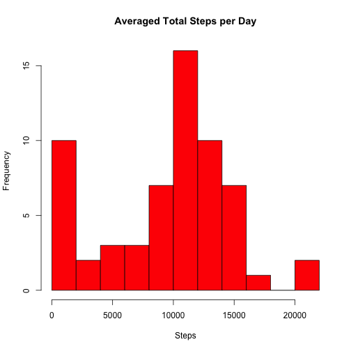
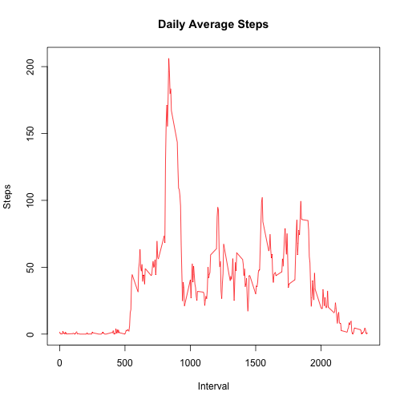
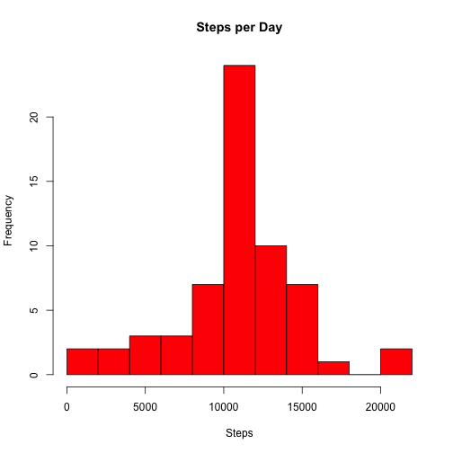
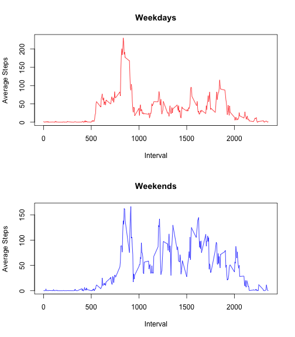

Introduction
======================
This is the first Peer Assignment for Coursera's *Reproducible Research* class. In this document, we will be exploring movement data collected from activity monitoring devices (such as a Fitbit, Nike Fuelband or Jawbone Up) and attempt to draw some basic conclusions about the user's behavior and lifestyle.

### Data
The basic data is composed of three columns: *date*, *interval*, and *steps*:

- **date**: The date (%Y-%m-%d) on which the data was collected.
- **interval**: The 5-minute interval on a certain day in which the data was collected.
- **steps**: The total number of steps counted within an interval on a certain day.

Procedure
===================
### Loading and Preprocessing Data
We begin by loading the unzipped `activity.csv` and reading it into R. We covert it into a dataframe, and preprocess the data by converting the `date` column into a Date type.

```r
activity = read.csv('./activity.csv')
activity <- data.frame(activity)
activity$date = as.Date(activity$date)
```

### What is mean total number of steps taken per day?
The first question posed is, *"what is the average number of [total] steps taken per day?"* To answer this, we do a simple aggregation on the `steps` column of the dataset given the `date`.


```r
stepsSum <- aggregate(activity$steps,by=list(activity$date),sum,na.rm=T)
names(stepsSum) <- c("Date", "Steps")
stepsSum
```

```
##          Date Steps
## 1  2012-10-01     0
## 2  2012-10-02   126
## 3  2012-10-03 11352
## 4  2012-10-04 12116
## 5  2012-10-05 13294
## 6  2012-10-06 15420
## 7  2012-10-07 11015
## 8  2012-10-08     0
## 9  2012-10-09 12811
## 10 2012-10-10  9900
## 11 2012-10-11 10304
## 12 2012-10-12 17382
## 13 2012-10-13 12426
## 14 2012-10-14 15098
## 15 2012-10-15 10139
## 16 2012-10-16 15084
## 17 2012-10-17 13452
## 18 2012-10-18 10056
## 19 2012-10-19 11829
## 20 2012-10-20 10395
## 21 2012-10-21  8821
## 22 2012-10-22 13460
## 23 2012-10-23  8918
## 24 2012-10-24  8355
## 25 2012-10-25  2492
## 26 2012-10-26  6778
## 27 2012-10-27 10119
## 28 2012-10-28 11458
## 29 2012-10-29  5018
## 30 2012-10-30  9819
## 31 2012-10-31 15414
## 32 2012-11-01     0
## 33 2012-11-02 10600
## 34 2012-11-03 10571
## 35 2012-11-04     0
## 36 2012-11-05 10439
## 37 2012-11-06  8334
## 38 2012-11-07 12883
## 39 2012-11-08  3219
## 40 2012-11-09     0
## 41 2012-11-10     0
## 42 2012-11-11 12608
## 43 2012-11-12 10765
## 44 2012-11-13  7336
## 45 2012-11-14     0
## 46 2012-11-15    41
## 47 2012-11-16  5441
## 48 2012-11-17 14339
## 49 2012-11-18 15110
## 50 2012-11-19  8841
## 51 2012-11-20  4472
## 52 2012-11-21 12787
## 53 2012-11-22 20427
## 54 2012-11-23 21194
## 55 2012-11-24 14478
## 56 2012-11-25 11834
## 57 2012-11-26 11162
## 58 2012-11-27 13646
## 59 2012-11-28 10183
## 60 2012-11-29  7047
## 61 2012-11-30     0
```

As the raw calculated data is a little difficult to digest for human eyes, we ease this with a visualization of the data as a histogram.


```r
hist(stepsSum$Steps, col='red', xlab='Steps', ylab='Frequency', main='Averaged Total Steps per Day', breaks=8)
```

 

By looking at the histogram, we can see that the measured user most commonly walks about 10K ~ 15K steps a day. We notice that there is a particular spike also very close to zero steps, possibly a result of our missing values in the dataset.

It may also be of interest to see what the average and median steps taken per day is as well.


```r
stepsAvg <- aggregate(activity$steps,by=list(activity$date),mean,na.rm=T)
stepsMed <- aggregate(activity$steps,by=list(activity$date),median,na.rm=T)
stepsAvgMed <- merge(stepsAvg, stepsMed, by='Group.1')
names(stepsAvgMed) <- c("Date", "Mean", "Median")
stepsAvgMed
```

```
##          Date       Mean Median
## 1  2012-10-01        NaN     NA
## 2  2012-10-02  0.4375000      0
## 3  2012-10-03 39.4166667      0
## 4  2012-10-04 42.0694444      0
## 5  2012-10-05 46.1597222      0
## 6  2012-10-06 53.5416667      0
## 7  2012-10-07 38.2465278      0
## 8  2012-10-08        NaN     NA
## 9  2012-10-09 44.4826389      0
## 10 2012-10-10 34.3750000      0
## 11 2012-10-11 35.7777778      0
## 12 2012-10-12 60.3541667      0
## 13 2012-10-13 43.1458333      0
## 14 2012-10-14 52.4236111      0
## 15 2012-10-15 35.2048611      0
## 16 2012-10-16 52.3750000      0
## 17 2012-10-17 46.7083333      0
## 18 2012-10-18 34.9166667      0
## 19 2012-10-19 41.0729167      0
## 20 2012-10-20 36.0937500      0
## 21 2012-10-21 30.6284722      0
## 22 2012-10-22 46.7361111      0
## 23 2012-10-23 30.9652778      0
## 24 2012-10-24 29.0104167      0
## 25 2012-10-25  8.6527778      0
## 26 2012-10-26 23.5347222      0
## 27 2012-10-27 35.1354167      0
## 28 2012-10-28 39.7847222      0
## 29 2012-10-29 17.4236111      0
## 30 2012-10-30 34.0937500      0
## 31 2012-10-31 53.5208333      0
## 32 2012-11-01        NaN     NA
## 33 2012-11-02 36.8055556      0
## 34 2012-11-03 36.7048611      0
## 35 2012-11-04        NaN     NA
## 36 2012-11-05 36.2465278      0
## 37 2012-11-06 28.9375000      0
## 38 2012-11-07 44.7326389      0
## 39 2012-11-08 11.1770833      0
## 40 2012-11-09        NaN     NA
## 41 2012-11-10        NaN     NA
## 42 2012-11-11 43.7777778      0
## 43 2012-11-12 37.3784722      0
## 44 2012-11-13 25.4722222      0
## 45 2012-11-14        NaN     NA
## 46 2012-11-15  0.1423611      0
## 47 2012-11-16 18.8923611      0
## 48 2012-11-17 49.7881944      0
## 49 2012-11-18 52.4652778      0
## 50 2012-11-19 30.6979167      0
## 51 2012-11-20 15.5277778      0
## 52 2012-11-21 44.3993056      0
## 53 2012-11-22 70.9270833      0
## 54 2012-11-23 73.5902778      0
## 55 2012-11-24 50.2708333      0
## 56 2012-11-25 41.0902778      0
## 57 2012-11-26 38.7569444      0
## 58 2012-11-27 47.3819444      0
## 59 2012-11-28 35.3576389      0
## 60 2012-11-29 24.4687500      0
## 61 2012-11-30        NaN     NA
```

We saw that although the total steps are often above 10K, on average this user walks very little across intervals. More often than not, this user is not walking, as indicated by the near uniform zero for every day. This implies the user is sitting (or still) for the most part, only walking occasionally.

### What is the average daily activity pattern?
Looking at the statistics based on the date alone does not seem very interesting. More interesting would be if the user's behavior changes within a single day (eg. in the morning vs the afternoon). We can instead examine the average steps per interval across every day.


```r
stepsIntervalAvg <- aggregate(activity$steps,by=list(activity$interval),mean,na.rm=T)
names(stepsIntervalAvg) <- c("Interval", "Steps")
plot(stepsIntervalAvg, type="l", col='red', main='Daily Average Steps')
```

 

The `interval` field does not exactly account for the full 1440 minutes of the user's day, but we can roughly gather that there is a period of time in which the user is most likely asleep (assuming that they are wearing their monitoring device), from interval 0-500. Once movement starts, there is a movement spike between interval 800-900 in which we may guess that the user may be exercising. The rest of the day would seem to be normal walking until movement ramps down towards the end.

We can see that the peak of movement occurs at Interval 835 with a rough average steps number of 206:

```r
stepsIntervalAvg[stepsIntervalAvg$Steps==max(stepsIntervalAvg$Steps),]
```

```
##     Interval    Steps
## 104      835 206.1698
```
**206 steps in 5 minutes** indicates **40 steps per minutes**. By contrast, we can consult Purdue University's [Convert Activity Into Steps](http://www.purdue.edu/walktothemoon/activities.html) reference. 40 steps per minute roughly translates to a person doing tai chi! If that is the peak steps of this person's average day, then the measured user must be a sloth! Clearly this is the result of averaging. For pure curiosity of the scope of the assignment, we can look at the maximum number of steps for the same interval 835 out of all the days.

```r
activity[activity$interval==835,][which.max(activity[activity$interval==835,]$steps),]
```

```
##      steps       date interval
## 4136   786 2012-10-15      835
```
This yields us a peak step count of **786 in 5 minutes** (which isn't too far from the overall max of 806), which is **~157 steps per minute**. Referencing Purdue University again, this roughly equates to a user engaging in **very moderate exercise**.

### Inputting missing values
Very early on in the exercise, it was clear that there were several N/A values within the dataset, forcing us to apply `na.rm=T` to several of our functions. Could this missing data have a significant impact on our analysis? It would be useful to have an idea of how biased our data is based on the number of missing values.

```r
nrow(activity)  # Total rows in dataset
```

```
## [1] 17568
```

```r
sum(is.na(activity$steps))  # Total N/A values in dataset
```

```
## [1] 2304
```

```r
sum(is.na(activity$steps))/nrow(activity)  # Percentage of missing values
```

```
## [1] 0.1311475
```
Over **10%** of our data is missing! If we can interpolate these missing values, it might provide us a better picture of the measured user's daily behavior.

To do this, we will interpolate each missing value with the **average of steps from the same interval** -- as we saw previously that the average by day was also heavily influenced by missing values, and the median by day was more often than not, zero.


```r
activityNew <- activity
for (x in stepsIntervalAvg$Interval) {
    activityNew[is.na(activityNew$steps) & activityNew$interval==x,]$steps <- stepsIntervalAvg[stepsIntervalAvg$Interval==x,]$Steps
}
```

Using this newly created `activityNew` dataset with the missing values filled in, let us see if this changes any of our previous observations.

```r
stepsSumNew <- aggregate(activityNew$steps,by=list(activityNew$date),sum,na.rm=T)
names(stepsSumNew) <- c("Date", "Steps")
hist(stepsSumNew$Steps, col='red', xlab='Steps', ylab='Frequency', main='Steps per Day', breaks=8)
```

 

From the new histogram, we can already see that the histogram has now assumed a more Gaussian distribution, as we should expect -- as it would be odd that a person either moves or has days where he/she is just sitting idly all day.


```r
stepsAvgNew <- aggregate(activityNew$steps,by=list(activityNew$date),mean,na.rm=T)
stepsMedNew <- aggregate(activityNew$steps,by=list(activityNew$date),median,na.rm=T)
stepsIntervalAvgNew <- aggregate(activity$steps,by=list(activityNew$interval),mean,na.rm=T)
names(stepsIntervalAvgNew) <- c("Interval", "Steps")
plot(stepsIntervalAvgNew, type="l", main='Daily Average Steps', col='red')
```

 

```r
stepsIntervalAvgNew[stepsIntervalAvgNew$Steps==max(stepsIntervalAvgNew$Steps),]
```

```
##     Interval    Steps
## 104      835 206.1698
```

By contrast, the steps by interval averaged over every day does not appear to have changed much at all. This would be expected, as we used this average to interpolate our data. 

### Are there differences in activity patterns between weekdays and weekends?
Finally, we know that a person's behavior on the weekday vs the weekend would be different. For example, most people attend school or hold an office job on weekdays, whereas they may either partake in more outside activities or in contrary sit at home all day watching television like a couch potato. What class of individual does our measured user belong to? Does his or her behavior change at all whether it is a weekend or not? To determine this, we will have to analyze the data by factoring the dataset into two classes: *weekday* and *weekend*.


```r
weekends <- c("Saturday", "Sunday")
weektype <- factor((weekdays(activityNew$date) %in% weekends)+1L, levels=1:2, labels=c('Weekday', 'Weekend'))
activityNew <- cbind(activityNew, weektype)
```

Having introduced a new factor, we can now graph the interval plot averaged across day, by weekday and by weekend.


```r
activityNewWeekday <- activityNew[activityNew$weektype=='Weekday',]
activityNewWeekend <- activityNew[activityNew$weektype=='Weekend',]
par(mfrow=c(2,1), bg=NA)
stepsIntervalWeekdayAvg <- aggregate(activityNewWeekday$steps,by=list(activityNewWeekday$interval),mean,na.rm=T)
names(stepsIntervalWeekdayAvg) <- c("Interval", "Average Steps")
plot(stepsIntervalWeekdayAvg, type="l", main='Weekdays', col='red')
stepsIntervalWeekendAvg <- aggregate(activityNewWeekend$steps,by=list(activityNewWeekend$interval),mean,na.rm=T)
names(stepsIntervalWeekendAvg) <- c("Interval", "Average Steps")
plot(stepsIntervalWeekendAvg, type="l", main='Weekends', col='blue')
```

 
dev.off()

From these two graphs a very clear disparity emerges.

- The individual is much more active on weekends -- as seen from more frequent spikes of over 100 steps whereas on weekdays in general the person makes less than 100 steps every interval.
- The individual wakes up later on weekends as well, as we see a slower ramp up of activity.
- Similarly, the individual stays up slightly later on weekends as well, or is at least more active than usual later in the evening.
- In contrast, that 'spike' we saw in the previous graph still exists on the weekend, but of a lower magnitude. Possibly the individual still exercises for a bit, but not as much due to other activities during the day.
